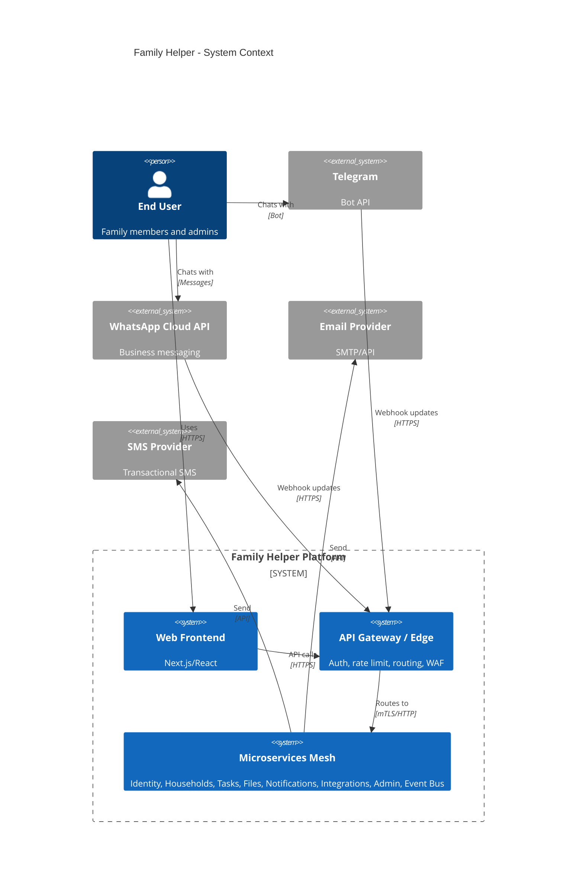

# Family Helper — End‑to‑End Architecture & Implementation Plan

**Author:** Principal Cloud/Solutions Architect  
**Audience:** Solo developer ramping up; future collaborators  
**Goal:** Ship a modular, multi‑channel, event‑driven platform that grows over time without re‑architecture.

---

## 1) Executive Summary
Family Helper is a multi‑channel microservices platform reachable via Web (URL), Telegram, and WhatsApp. The system uses an API Gateway at the edge and a lightweight event bus inside. Core domains—Identity, Households, Files, Tasks, Notifications, Integrations—are small, loosely coupled services. Shared platform wrappers abstract cloud specifics (config, secrets, db, storage, queues, cache, search, metrics/tracing, feature flags, auth) to minimize vendor lock‑in. Future modules (Document Organizer, Chores Helper, etc.) plug in through HTTP APIs and domain events.

---

## 2) High‑Level Architecture (HLA)

### 2.1 Narrative
- Multi‑channel ingress: Web App, Telegram Bot, WhatsApp Business Cloud API → **API Gateway/Edge** for auth, rate limits, WAF, routing.  
- Core microservices expose small HTTP APIs and publish/consume domain events via **Event Bus (pub/sub + queues + DLQ)**.  
- Cross‑cutting concerns are provided by **Platform Wrappers** per language: logger, config, secrets, db, cache, object storage, pub/sub, search, feature flags, tracing/metrics, auth middleware.  
- Data: Postgres (core relational), S3‑compatible object store (files), Redis (cache, queues), optional search (OpenSearch/Elastic).  
- Observability built‑in: structured logs, OpenTelemetry traces, RED/USE metrics, SLO dashboards.

### 2.2 C4 System Context (Mermaid)


### 2.3 C4 Container View (Mermaid)
```mermaid
C4Container
title Family Helper - Container View
Boundary(edge, "Edge"){
  Container(alb, "API Gateway/Edge", "Envoy/NGINX + OIDC", "AuthN/Z, rate limit, JWT, WAF")
  Container(front, "Web Frontend", "Next.js", "SSR + SPA")
  Container(bot, "Bot Gateway", "Node.js (grammY/Telegraf) + WA adapter", "Normalizes bot events -> internal API/events")
}
Boundary(core, "Core Services"){
  Container(id, "Identity & Accounts", "TypeScript (NestJS)", "OAuth/social, roles/permissions")
  Container(hh, "Households & Memberships", "Go (Chi)", "Multi-tenant household core")
  Container(up, "User Profile & Prefs", "Python (FastAPI)", "i18n/RTL, locale & timezone")
  Container(tasks, "Tasks & Scheduling", "Kotlin (Spring Boot)", "Recurrence rules, reminders")
  Container(files, "Files & Documents", "Python (FastAPI)", "Uploads, metadata, OCR hook")
  Container(intg, "Integrations Hub", "TypeScript (NestJS)", "3P connectors, webhooks, polling")
  Container(notify, "Notifications", "TypeScript (NestJS + BullMQ)", "Email/SMS/Telegram/WhatsApp fan-out")
  Container(admin, "Admin & Audit", "Go (Fiber)", "Audit log, flags, configuration")
  Container(bus, "Event Bus / Orchestrator", "SNS/SQS abstraction", "Pub/Sub, DLQs, Sagas")
}
Boundary(data, "Data & Infra"){
  ContainerDb(pg, "Postgres (Aurora/RDS)", "SQL", "Identity, Households, Tasks, Metadata, Audit")
  Container(blob, "Object Storage", "S3-like", "File blobs")
  Container(cache, "Cache", "Redis", "Sessions, rate limit, schedules")
  Container(search, "Search", "OpenSearch/Elastic", "Docs & metadata search (future)")
  Container(obs, "Observability", "Logs + Traces + Metrics", "Structured logs, W3C traceparent")
  Container(sec, "Secrets/KMS", "Secrets Manager + KMS", "Secret storage, encryption")
}
Rel(alb, id, "JWT/OAuth", "HTTP")
Rel(alb, hh, "REST", "HTTP")
Rel(alb, up, "REST", "HTTP")
Rel(alb, tasks, "REST", "HTTP")
Rel(alb, files, "REST", "HTTP")
Rel(alb, intg, "REST", "HTTP")
Rel(alb, notify, "REST", "HTTP")
Rel(bot, notify, "createMessage", "HTTP")
Rel(tasks, notify, "TaskDue -> send", "Events")
Rel(files, bus, "FileUploaded", "Event")
Rel(id, bus, "UserCreated", "Event")
Rel(hh, bus, "HouseholdCreated", "Event")
Rel(bus, notify, "consume", "SQS")
Rel(bus, intg, "consume", "SQS")
Rel(files, blob, "PUT/GET", "S3 API")
Rel(*, pg, "SQL", "Pg")
Rel(*, cache, "get/set", "Redis")
Rel(*, obs, "emit", "OTel")
Rel(*, sec, "read", "API")
Rel(files, search, "index", "HTTP")
```

---

## 3) Service Catalog

| Service | Primary Responsibility | Language + Framework | Data Store | Sync/Async Interfaces | Scalability Approach | Where Modules Connect | Notes/Rationale |
|---|---|---|---|---|---|---|---|
| API Gateway / Edge | AuthN/Z (OIDC/JWT), rate limit, WAF, routing, canary | Envoy/NGINX + Lua/OPA plugin | N/A | HTTP (OpenAPI), mTLS upstream | Stateless, HPA on RPS, CDN | All module HTTP routes | Mature edge patterns; portable |
| Identity & Accounts | Users, auth flows, OAuth/social, roles/permissions | **TypeScript (NestJS)** | Postgres | REST (OpenAPI), emits `UserCreated` | Horizontal; stateless | Modules query user/role; subscribe to user events | TS/Nest = fast dev, rich ecosystem |
| User Profile & Preferences | Locale, timezone (default Asia/Jerusalem), i18n/RTL prefs | **Python (FastAPI)** | Postgres | REST; listens `UserCreated` | Stateless | Modules read prefs for localization | Python + Pydantic speed |
| Household & Memberships | Multi-tenant household graph, invitations | **Go (Chi/Fiber)** | Postgres | REST; emits `HouseholdCreated`; listens `UserCreated` | Low‑mem; fast | Modules check membership & ACLs | Go perf, tiny images |
| Tasks & Scheduling | Recurrence (RFC 5545‑ish), reminder plans | **Kotlin (Spring Boot)** | Postgres + Redis | REST; emits `TaskScheduled` & `TaskDue`; consumes events | Workers; time‑wheel/Redis ZSET | Chores module extends task types | JVM scheduling maturity |
| Files & Documents | Upload, presign, metadata, OCR hook | **Python (FastAPI)** | Postgres (metadata), S3 (blobs), OpenSearch (opt.) | REST; emits `FileUploaded` | Stateless + workers | Doc Organizer subscribes | Python OCR/libs |
| Integrations Hub | 3P connectors, webhooks, polling | **TypeScript (NestJS)** | Postgres | REST; sub/emit events | Workers per connector | New modules add connectors | Broad SaaS SDKs |
| Notifications | Email/SMS/Push/Telegram/WhatsApp | **TypeScript (NestJS + BullMQ)** | Redis + Postgres | REST; subscribes events | Queue workers, rate limits | All modules fan‑out messages | Strong provider SDKs |
| Event Bus / Orchestrator | Pub/Sub, DLQ, outbox, sagas, idempotency | **Go** | Postgres (outbox) + SNS/SQS | Async events; minimal HTTP admin | Topic/queue sharding | Modules publish/subscribe | Go clients, low latency |
| Admin & Audit | Audit log, flags, safe configs | **Go (Fiber)** | Postgres (+ S3 for cold) | REST + event streams | Light | Modules write audit/read flags | Simple & secure |
| Bot Gateway | Normalize bot updates; commands | **TypeScript** | Redis (sessions) | Webhooks → REST/events | Stateless | Modules register commands | Unified “/help modules” |
| Web Frontend | SSR + SPA | **Next.js/React** | N/A | Calls Gateway | CDN | New modules add pages/routes | RTL‑aware UI kit |

---

## 4) Platform & Wrappers

### 4.1 Interfaces (language‑agnostic, TS‑style)
```ts
export interface Logger { info(msg: string, meta?: Record<string, unknown>): void; error(msg: string, meta?: Record<string, unknown>): void; with(fields: Record<string, unknown>): Logger; }
export interface Config { get<T=string>(key: string, opts?: { required?: boolean, default?: T }): T; }
export interface Secrets { get(name: string): Promise<string>; }
export interface Db { query<T>(sql: string, params?: unknown[]): Promise<T[]>; withTx<T>(fn: (tx: Db) => Promise<T>): Promise<T>; }
export interface Cache { get<T>(key: string): Promise<T|null>; set<T>(key: string, value: T, ttlSec?: number): Promise<void>; }
export interface ObjectStorage { put(key: string, bytes: Buffer, contentType: string): Promise<{etag: string}>; presignPut(key: string, expiresSec: number): Promise<string>; presignGet(key: string, expiresSec: number): Promise<string>; }
export interface PubSub { publish(topic: string, event: unknown, opts?: { idempotencyKey?: string }): Promise<void>; subscribe(topic: string, handler: (e: EventEnvelope) => Promise<void>): Unsubscribe; }
export interface Search { index(index: string, id: string, doc: unknown): Promise<void>; query(index: string, dsl: unknown): Promise<unknown>; }
export interface FeatureFlags { isEnabled(flag: string, context?: Record<string, unknown>): Promise<boolean>; }
export interface Tracer { startSpan(name: string, fn: () => Promise<void>): Promise<void>; }
```

### 4.2 Example Usage (TypeScript)
```ts
// services/households/src/handlers/createHousehold.ts
import { db, pubsub, logger, authz } from "@platform-ts";
export async function createHousehold(req, res) {
  const user = authz.requireUser(req);
  const { name } = req.body;
  const [hh] = await db.query(
    "insert into households (name, owner_user_id) values ($1,$2) returning *",
    [name, user.id]
  );
  await pubsub.publish("HouseholdCreated:v1", { householdId: hh.id, ownerUserId: user.id }, { idempotencyKey: `hh-${hh.id}` });
  logger.info("household.created", { id: hh.id, owner: user.id });
  res.status(201).json(hh);
}
```

### 4.3 Example Usage (Python)
```python
# services/files/app/routes.py
from platform_py import db, storage, pubsub, log
from fastapi import APIRouter, UploadFile

router = APIRouter()

@router.post("/files")
async def upload(file: UploadFile):
    key = f"files/{file.filename}"
    content = await file.read()
    await storage.put(key, content, file.content_type or "application/octet-stream")
    row = await db.query_one(
        "insert into files (key, name, content_type) values ($1,$2,$3) returning id",
        [key, file.filename, file.content_type]
    )
    await pubsub.publish("FileUploaded:v1", {"fileId": row["id"], "key": key})
    log.info("file.uploaded", {"file_id": row["id"], "key": key})
    return {"id": row["id"], "key": key}
```

### 4.4 Cloud Mappings

| Wrapper | AWS (Primary) | GCP | Azure |
|---|---|---|---|
| Config | SSM Parameter Store | Runtime Config/Secrets | App Config/Key Vault |
| Secrets | Secrets Manager (+KMS) | Secret Manager | Key Vault |
| Db | Aurora/RDS (Postgres) | Cloud SQL | Azure Database for PostgreSQL |
| Cache | ElastiCache (Redis) | Memorystore | Azure Cache for Redis |
| ObjectStorage | S3 | Cloud Storage | Blob Storage |
| PubSub | SNS+SQS (FIFO) / EventBridge | Pub/Sub | Service Bus / Event Grid |
| Search | OpenSearch Service | Elastic / self‑host | Azure Cognitive Search / Elastic |
| Tracing/Metrics | CloudWatch + X‑Ray / OTel | Cloud Monitoring + Trace / OTel | Azure Monitor + App Insights / OTel |
| Feature Flags | LaunchDarkly/Unleash | LaunchDarkly/Unleash | LaunchDarkly/Unleash |
| Auth | Cognito (or Auth0/Okta) | Firebase/Auth0/Okta | Entra ID B2C/Auth0 |

---

## 5) Cloud Architecture

### 5.1 Chosen Cloud & Rationale
**AWS**: broad managed services (SNS/SQS, RDS, S3), cost‑efficient containers (**ECS/Fargate**), OIDC with GitHub Actions, mature WAF/CDN.

### 5.2 Network & Security
- **VPC:** 3 AZs; public subnets (ALB/WAF); private subnets (ECS tasks, RDS, Redis).  
- **Ingress:** Route53 → CloudFront (Web) → WAF → ALB (Gateway). Telegram/WhatsApp webhooks via allow‑lists.  
- **Egress:** NAT Gateway(s) for private subnets (minimize count in dev).  
- **Secrets:** Secrets Manager + KMS CMK; rotation policies.  
- **Auth:** OIDC (Cognito/Auth0); JWT validate via JWKS; optional mTLS internal.

### 5.3 Compute
- **Primary:** ECS on Fargate (per‑service task), HPA on CPU/RPS.  
- **Workers:** ECS/Fargate consumers for queues.  
- **Serverless (selective):** Lambda for infrequent webhooks/CRON.  
- **CDN:** CloudFront for Next.js assets.

### 5.4 CI/CD (GitHub Actions)
```yaml
name: ci-cd
on:
  push:
    branches: [main]
jobs:
  build-test:
    runs-on: ubuntu-latest
    strategy:
      matrix:
        service: [gateway, identity, households, profiles, tasks, files, integrations, notifications, admin, bot, web]
    steps:
      - uses: actions/checkout@v4
      - uses: actions/setup-node@v4
        with: { node-version: '20' }
      - name: Install
        run: |
          if [ -f services/${{matrix.service}}/package.json ]; then
            cd services/${{matrix.service}} && npm ci
          fi
      - name: Test
        run: |
          if [ -f services/${{matrix.service}}/package.json ]; then
            cd services/${{matrix.service}} && npm test --if-present
          fi
      - name: Docker build
        run: docker build -t ghcr.io/you/fh-${{matrix.service}}:$(git rev-parse --short HEAD) services/${{matrix.service}}
      - name: Login GHCR
        uses: docker/login-action@v3
        with: { registry: ghcr.io, username: ${{ github.actor }}, password: ${{ secrets.GITHUB_TOKEN }} }
      - name: Push
        run: docker push ghcr.io/you/fh-${{matrix.service}}:$(git rev-parse --short HEAD)

  deploy:
    needs: build-test
    runs-on: ubuntu-latest
    permissions:
      id-token: write
      contents: read
    steps:
      - uses: actions/checkout@v4
      - uses: hashicorp/setup-terraform@v3
      - name: Configure AWS creds (OIDC)
        uses: aws-actions/configure-aws-credentials@v4
        with:
          role-to-assume: arn:aws:iam::<acct>:role/GitHubOIDC
          aws-region: us-east-1
      - name: Terraform Init/Plan/Apply
        working-directory: deploy/iac/envs/dev
        run: |
          terraform init -backend-config=backend.hcl
          terraform validate
          terraform plan -out tf.plan
          terraform apply -auto-approve tf.plan
      - name: Smoke tests
        run: ./deploy/scripts/smoke.sh https://api.dev.familyhelper.app/health
```

### 5.5 IaC: Terraform (Minimal)
```hcl
# deploy/iac/modules/network/main.tf
module "vpc" {
  source  = "terraform-aws-modules/vpc/aws"
  name    = var.name
  cidr    = "10.0.0.0/16"
  azs     = ["us-east-1a","us-east-1b","us-east-1c"]
  public_subnets  = ["10.0.1.0/24","10.0.2.0/24","10.0.3.0/24"]
  private_subnets = ["10.0.11.0/24","10.0.12.0/24","10.0.13.0/24"]
}

# deploy/iac/modules/queue/main.tf
resource "aws_sqs_queue" "events" {
  name                        = "${var.env}-events.fifo"
  fifo_queue                  = true
  content_based_deduplication = true
  visibility_timeout_seconds  = 60
}

# deploy/iac/envs/dev/main.tf
module "network" { source = "../../modules/network"; name="fh-dev" }
module "queue"   { source = "../../modules/queue";  env="dev" }

output "events_queue_url" { value = module.queue.events_url }
```

---

## 6) Data & Contracts

### 6.1 Core ERD (Mermaid)
```mermaid
erDiagram
  USER ||--o{ MEMBERSHIP : has
  HOUSEHOLD ||--o{ MEMBERSHIP : has
  ROLE ||--o{ MEMBERSHIP : grants
  USER {
    uuid id PK
    text email
    text display_name
    text locale
    text tz
    timestamptz created_at
  }
  HOUSEHOLD {
    uuid id PK
    text name
    uuid owner_user_id FK
    timestamptz created_at
  }
  ROLE {
    text name PK
    text description
  }
  MEMBERSHIP {
    uuid id PK
    uuid user_id FK
    uuid household_id FK
    text role_name FK
    timestamptz invited_at
    timestamptz accepted_at
  }
  TASK {
    uuid id PK
    uuid household_id FK
    uuid created_by FK
    text title
    text notes
    jsonb recurrence_rule
    timestamptz due_at
    text status
  }
  REMINDER {
    uuid id PK
    uuid task_id FK
    interval lead_time
    text channel
    text target
  }
  FILE {
    uuid id PK
    uuid household_id FK
    text key
    text name
    text content_type
    bigint size
    timestamptz uploaded_at
  }
  FILE_METADATA {
    uuid file_id PK FK
    jsonb metadata
    text ocr_status
  }
  AUDIT_EVENT {
    uuid id PK
    uuid actor_user_id FK
    text action
    jsonb data
    timestamptz at
  }
```

### 6.2 Representative OpenAPI Snippets
**Create household**
```yaml
paths:
  /households:
    post:
      summary: Create a household
      security: [{ bearerAuth: [] }]
      requestBody:
        required: true
        content:
          application/json:
            schema:
              type: object
              required: [name]
              properties:
                name: { type: string }
      responses:
        "201":
          description: Created
          content:
            application/json:
              schema:
                $ref: "#/components/schemas/Household"
components:
  schemas:
    Household:
      type: object
      properties:
        id: { type: string, format: uuid }
        name: { type: string }
        ownerUserId: { type: string, format: uuid }
```

**Invite member**
```yaml
/households/{id}/invites:
  post:
    summary: Invite a user by email
    parameters: [{ name: id, in: path, required: true, schema: { type: string, format: uuid }}]
    requestBody:
      content:
        application/json:
          schema:
            type: object
            required: [email, role]
            properties:
              email: { type: string, format: email }
              role: { type: string, enum: [owner, admin, member, child] }
    responses:
      "202": { description: Invitation queued }
```

**Schedule recurring task**
```yaml
/tasks:
  post:
    summary: Create a recurring task
    requestBody:
      content:
        application/json:
          schema:
            type: object
            required: [householdId, title, recurrenceRule]
            properties:
              householdId: { type: string, format: uuid }
              title: { type: string }
              notes: { type: string }
              recurrenceRule: { type: string, example: "RRULE:FREQ=WEEKLY;BYDAY=SU,WE;BYHOUR=20;BYMINUTE=0" }
              firstOccurrence: { type: string, format: date-time }
    responses:
      "201": { description: Created }
```

**Upload file metadata (presign flow)**
```yaml
/files/presign:
  post:
    summary: Get presigned URL to upload
    requestBody:
      content:
        application/json:
          schema:
            type: object
            required: [name, contentType, size]
            properties:
              name: { type: string }
              contentType: { type: string }
              size: { type: integer }
    responses:
      "200":
        content:
          application/json:
            schema:
              type: object
              properties:
                fileId: { type: string, format: uuid }
                uploadUrl: { type: string }
                key: { type: string }
```

### 6.3 Event Schemas (JSON Schema)
**Envelope (shared)**
```json
{
  "$id": "https://familyhelper.dev/schemas/EventEnvelope.json",
  "type": "object",
  "required": ["id", "type", "occurredAt", "payload", "idempotencyKey"],
  "properties": {
    "id": { "type": "string", "format": "uuid" },
    "type": { "type": "string" },
    "occurredAt": { "type": "string", "format": "date-time" },
    "idempotencyKey": { "type": "string" },
    "payload": { "type": "object" },
    "trace": { "type": "object", "properties": { "traceparent": { "type": "string" } } }
  }
}
```

**HouseholdCreated:v1**
```json
{
  "$id": "https://familyhelper.dev/schemas/HouseholdCreated.v1.json",
  "type": "object",
  "required": ["householdId", "ownerUserId"],
  "properties": {
    "householdId": { "type": "string", "format": "uuid" },
    "ownerUserId": { "type": "string", "format": "uuid" },
    "name": { "type": "string" }
  }
}
```

**TaskScheduled:v1**
```json
{
  "$id": "https://familyhelper.dev/schemas/TaskScheduled.v1.json",
  "type": "object",
  "required": ["taskId", "nextDueAt"],
  "properties": {
    "taskId": { "type": "string", "format": "uuid" },
    "nextDueAt": { "type": "string", "format": "date-time" },
    "householdId": { "type": "string", "format": "uuid" }
  }
}
```

**FileUploaded:v1**
```json
{
  "$id": "https://familyhelper.dev/schemas/FileUploaded.v1.json",
  "type": "object",
  "required": ["fileId", "key"],
  "properties": {
    "fileId": { "type": "string", "format": "uuid" },
    "key": { "type": "string" },
    "contentType": { "type": "string" },
    "size": { "type": "integer" }
  }
}
```

**NotificationDispatched:v1**
```json
{
  "$id": "https://familyhelper.dev/schemas/NotificationDispatched.v1.json",
  "type": "object",
  "required": ["channel", "target", "template", "messageId"],
  "properties": {
    "channel": { "type": "string", "enum": ["email","sms","telegram","whatsapp","push"] },
    "target": { "type": "string" },
    "template": { "type": "string" },
    "messageId": { "type": "string" },
    "correlationId": { "type": "string" }
  }
}
```

**Retry semantics:** Publish with `idempotencyKey`; use FIFO queues for exactly‑once where needed. Consumers store processed keys (Redis) with TTL to ensure idempotency.

---

## 7) Non‑Functional Requirements (NFRs)

### 7.1 Security & Privacy
- PII minimization; column‑level encryption (KMS).  
- IAM least privilege; per‑service roles; strict SGs.  
- Secrets rotation (≤ 90 days); DB IAM auth where possible.  
- Retention: audit (≥ 365 days), logs (30–90), DLQ (14).  
- GDPR‑style export/delete via Admin.

### 7.2 Observability
- Logs: JSON `{ts, level, svc, trace_id, span_id, msg, meta}`.  
- Tracing: W3C `traceparent`; OpenTelemetry in all services.  
- Metrics: RED for APIs; USE for workers/queues.  
- Dashboards: API p50/p95, error rate, queue depth, task lag, notification success.  
- Alerts/SLOs: Web p95 < 300 ms; err < 1% (5‑min); Task lag p95 < 10 s; Notification success > 98%.

### 7.3 Reliability
- Retries w/ exponential backoff (base 200ms, max 5).  
- Circuit breakers at gateway.  
- DLQs per consumer; replay tooling.  
- Outbox pattern; idempotent handlers.

### 7.4 i18n/RTL, Timezones, Accessibility
- All timestamps UTC; render per user tz (default **Asia/Jerusalem**).  
- RTL‑aware UI (logical CSS props, LTR/RTL toggle).  
- ICU MessageFormat for text; Hebrew translations per namespace.  
- WCAG 2.1 AA; keyboard nav; semantic HTML.

---

## 8) Implementation Path

### Phase 0 – Foundations (Weeks 1–2)
- Repos: **poly‑repo** for services + shared `platform` packages.  
- Build platform wrappers (TS & Python initially); minimal Go/Kotlin helpers.  
- Terraform: VPC, S3 (artifacts), ECR/GHCR, SQS (FIFO), RDS (dev), Secrets.  
- GitHub Actions pipeline (build, test, docker, tf apply, smoke).  
- Skeleton services with `/healthz`.

**Definition of Done:** CI green, images pushed, `terraform apply` up, gateway & identity health‑checks green.

### Phase 1 – Core Platform (Weeks 3–6)
- Identity: email/password + Google OAuth; roles; JWTs.  
- Households: create/join; invite endpoint → Notification.  
- Notifications: Telegram & Email channels; templates.  
- Event Bus: outbox; DLQ; replayer CLI.  
- Web Gateway; **Telegram bot MVP** (`/start`, `/join`, `/help`).  
- Admin & Audit.

**DoD:** Create household via web; invite triggers TG/email; audit entries visible; no DLQ backlog.

### Phase 2 – Extensibility (Weeks 7–10)
- Files service: presigned upload, metadata, `FileUploaded` event.  
- Tasks & Scheduling: recurrence + due dispatcher → `TaskDue`.  
- Notifications: WhatsApp Cloud API; SMS fallback.  
- Integrations Hub skeleton: webhook intake + token storage.

**DoD:** Upload file via web; `/list files` via bot; create recurring task; receive TG/WA reminder.

### Phase 3 – Hardening (Weeks 11–12)
- Observability dashboards + alerts.  
- Security review; secret rotation runbook.  
- Cost guardrails (budgets & alerts).  
- Backups & PITR for Postgres; DR docs.

**DoD:** Dashboards live; budgets alert; restore drill documented.

### Phase 4 – First Module Stubs
- **Document Organizer** stub: subscribes `FileUploaded`; `/documents/*` routes.  
- **Chores Helper** stub: subscribes `TaskDue`; `/chores/*` routes.  
- Playbook: how to add a new module (HTTP + events + storage + auth scopes).

**DoD:** Stubs deploy, receive events, expose routes returning 501 with contract docs.

---

## 9) Repository Blueprint
```
/services
  /gateway-edge/
  /identity/
  /households/
  /profiles/
  /tasks/
  /files/
  /integrations/
  /notifications/
  /admin/
  /bot/
  /web/

/platform
  /ts/
  /python/
  /go/
  /kotlin/
  /schemas/

/deploy
  /iac/
    /modules/
    /envs/dev/
  /pipelines/
  /scripts/

/docs
  /adr/
  /runbooks/
  /api/

/examples
  /curl/
  /bot-commands/
```

### 9.1 ADR Summaries
- **ADR‑001: Event Bus (SNS+SQS vs Kafka)** → Start SNS+SQS FIFO; revisit if >5k msgs/s strict ordering.  
- **ADR‑002: Poly‑repo + Shared Platform** → Clear ownership, versioned platform; manage cross‑repo releases.  
- **ADR‑003: Containers on ECS/Fargate** → Language diversity, predictable; Lambda for niche webhooks later.

---

## 10) Risk Register & Mitigations
| Risk | Impact | Mitigation |
|---|---|---|
| Vendor lock‑in | Rewrites on cloud move | Wrappers; portable libs; cloud‑agnostic contracts |
| Integration churn | Broken connectors | Adapter pattern; contract tests; feature flags |
| Messaging complexity | Lost/dup events | Outbox; idempotency; FIFO; DLQs + replayer |
| Cost overrun | High idle costs | Small Fargate tasks; scale‑to‑zero workers; budgets/alerts |
| Security gaps | PII exposure | WAF, OIDC, least‑privilege IAM, audit, rotation |

---

## 11) Rough Costing (Starter)
- **Dev/Stage (low traffic):** 6–8 small Fargate tasks + 1–2 workers; RDS small; Redis small; S3 minimal; SQS/SNS minimal; CloudWatch basic; CloudFront minimal → **low hundreds USD/month**.  
- **Small Prod:** multi‑AZ DB/Redis; WAF adds cost; still modest.  
- **Levers:** Reduce NATs (dev), consolidate services early, spot for non‑critical workers, prune logs.

---

## 12) Appendices

### 12.1 Bot Command Map (stub)
- `/start` — Greeter; link to web app.  
- `/join <invite>` — Accept invite; calls Households.  
- `/task add <text>` — Creates quick task; calls Tasks.  
- `/files upload` — Returns presign URL; Files.

### 12.2 Definition of Done (per Phase)
- **P0:** CI green, dev infra up, health checks green.  
- **P1:** Household creation + invite path E2E, audit written, TG bot usable.  
- **P2:** Files + Tasks usable, WA/TG notifications delivered.  
- **P3:** Dashboards/alerts active, security & cost guardrails live.  
- **P4:** Module stubs wired to events + routes.

### 12.3 Performance Targets (initial)
- API p95 < 300 ms; 99.9% monthly uptime target.  
- Task scheduling lag p95 < 10 s; Notification success > 98%.  
- File upload presign < 150 ms; OCR async SLA best‑effort.

### 12.4 i18n/RTL Notes
- Store language + direction in user prefs; React app toggles RTL via CSS logical properties; templates per locale (he‑IL default where appropriate).

---

**End of Document**

